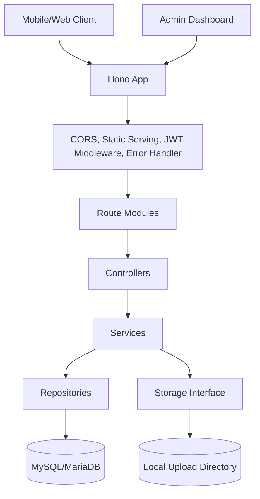
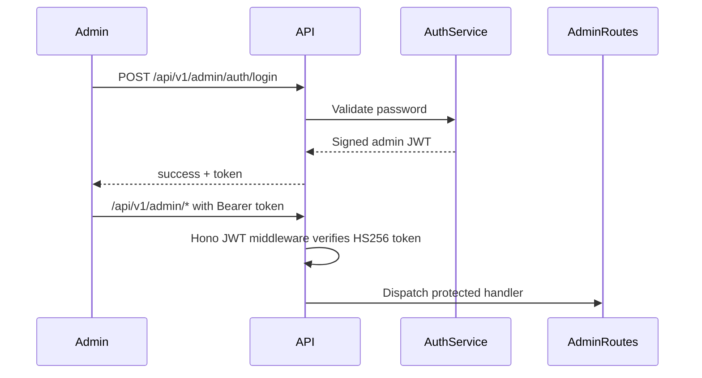
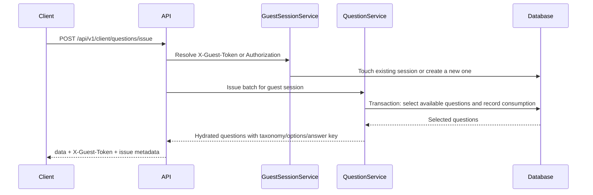
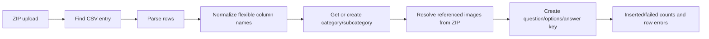
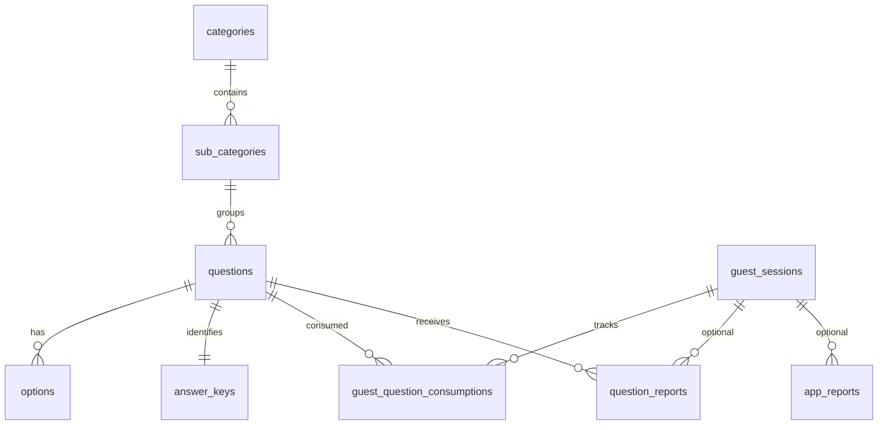

# CPNS Harian API

Backend API for a CPNS practice-question application. The service exposes public quiz endpoints for anonymous users, JWT-protected administration endpoints for content management, local media upload/serving, bulk question imports, and issue-report collection.

The implementation is intentionally small and layered: HTTP routing is handled by Hono, request validation by Zod, business rules by service classes, persistence by Drizzle ORM, and the database by MySQL/MariaDB.

## What This System Does

CPNS Harian API manages a taxonomy of categories, subcategories, questions, options, answer keys, guest sessions, and user/admin reports.

Primary use cases implemented in this repository:

| Area                      | Implemented behavior                                                                                                                   |
| ------------------------- | -------------------------------------------------------------------------------------------------------------------------------------- |
| Public quiz client        | Fetch menus, retrieve randomized questions, request anonymous guest-specific question batches, and report question issues.             |
| Training/playground modes | Retrieve random questions by category name filters or fetch one random question for lightweight practice/testing flows.                |
| Admin content management  | Authenticate an admin, manage categories/subcategories/questions, upload images, bulk import questions from ZIP + CSV, review reports. |
| Guest session tracking    | Issue long-lived anonymous JWTs and avoid reissuing recently consumed questions for the same guest session.                            |
| Media handling            | Save uploaded files under local storage and serve them through static routes.                                                          |
| Reporting                 | Store question-quality reports and general application reports, optionally associated with guest sessions.                             |

## Tech Stack

| Layer           | Technology                                  |
| --------------- | ------------------------------------------- |
| Runtime         | Bun                                         |
| HTTP framework  | Hono                                        |
| Validation      | Zod                                         |
| Database access | Drizzle ORM                                 |
| Database        | MySQL/MariaDB                               |
| Authentication  | Hono JWT, HS256                             |
| File storage    | Local filesystem behind a storage interface |
| Bulk parsing    | JSZip and csv-parse                         |
| Type safety     | TypeScript strict mode                      |

## Architecture



The code follows a layered architecture:

| Layer           | Responsibilities                                                                                                 | Examples                                  |
| --------------- | ---------------------------------------------------------------------------------------------------------------- | ----------------------------------------- |
| App composition | CORS policy, static routes, route mounting, admin JWT middleware, global error handling, health response.        | `src/app.ts`, `src/index.ts`              |
| Routes          | Map HTTP paths to controller methods.                                                                            | `src/routes/*.routes.ts`                  |
| Controllers     | Parse request input, run Zod validation, normalize query parameters, call services, return response envelopes.   | `src/controllers/*.controller.ts`         |
| Services        | Enforce business rules, orchestrate repositories/storage, normalize payloads, handle imports and guest sessions. | `src/services/*.service.ts`               |
| Repositories    | Execute Drizzle queries, joins, pagination, inserts, updates, deletes, and transactions.                         | `src/repositories/*.repository.ts`        |
| Database schema | Define tables, relationships, indexes, and generated migration files.                                            | `src/db/schema.ts`, `src/db/migrations/*` |
| Utilities       | Shared validation/error helpers and text/math utilities.                                                         | `src/core/*`, `src/utils/*`               |

## Request Flow

### Admin Authentication And Protected Routes



Admin login checks a configured admin password and returns a signed JWT containing an admin subject, role, issued-at time, and expiration. All `/api/v1/admin/*` routes except `/api/v1/admin/auth/*` are protected by Hono JWT middleware.

### Anonymous Guest Question Issuance



Question issuing applies a three-day cooldown per guest session. The repository selects questions that do not have a recent consumption record for the guest, allocates the requested limit across the selected subcategories, records consumption inside the same database transaction, then hydrates the response with options, answer keys, and taxonomy names.

If the client omits a guest token, sends an invalid token, or sends an expired token, the service creates a new anonymous session and returns a replacement token in the response header.

### Bulk Question Import



Bulk imports accept a ZIP archive containing at least one CSV file and optional image files. Each CSV row is processed independently. Successful rows are inserted; failed rows are counted and returned with row-level error messages. Category and subcategory names are created on demand if they do not already exist.

## Domain Model



| Entity                        | Purpose                                                                                         |
| ----------------------------- | ----------------------------------------------------------------------------------------------- |
| `categories`                  | Top-level content groups, with unique names.                                                    |
| `sub_categories`              | Child taxonomy nodes under a category.                                                          |
| `questions`                   | Question body, optional image, optional explanation, HOTS flag, difficulty, creation timestamp. |
| `options`                     | Answer options for a question; each option may contain text, an image, or both.                 |
| `answer_keys`                 | One correct option per question.                                                                |
| `guest_sessions`              | Anonymous session identity, last-seen timestamp, and a nullable future user-link field.         |
| `guest_question_consumptions` | Per-session question consumption history with a unique guest/question pair and timestamp index. |
| `question_reports`            | Reports about a specific question, such as wrong answer key or poor explanation.                |
| `app_reports`                 | General application reports with optional screenshot URLs serialized as JSON text.              |

Question, option, and answer-key writes are transactionally grouped for create/update operations. Question deletion relies on database-level cascade behavior for options and answer keys as defined in the schema.

## API Surface

All application responses use a JSON envelope.

Successful responses include `success: true` plus endpoint-specific fields:

```json
{
  "success": true,
  "data": {}
}
```

Errors include `success: false` and a structured error object:

```json
{
  "success": false,
  "error": {
    "code": "VALIDATION_ERROR",
    "message": "Validation failed",
    "details": {}
  }
}
```

### Public Client Routes

| Method | Path                                 | Purpose                                                                        |
| ------ | ------------------------------------ | ------------------------------------------------------------------------------ |
| `GET`  | `/api/v1/client/menus`               | Return categories with nested subcategories.                                   |
| `GET`  | `/api/v1/client/questions`           | Return randomized questions for one subcategory, with optional HOTS filtering. |
| `GET`  | `/api/v1/client/questions/training`  | Return randomized training questions by category names.                        |
| `GET`  | `/api/v1/client/playground/question` | Return one random question, optionally filtered by subcategory and HOTS flag.  |
| `POST` | `/api/v1/client/questions/issue`     | Issue guest-specific question batches and record cooldown consumption.         |
| `POST` | `/api/v1/client/questions/report`    | Create a report for a specific question.                                       |
| `POST` | `/api/v1/client/upload/image`        | Upload report screenshots/images.                                              |
| `POST` | `/api/v1/client/reports`             | Create a general application report.                                           |

Client question list endpoints enforce `limit` bounds from 1 to 100. Training category filters accept repeated query keys or comma-separated values and are matched case-insensitively against category names.

One implementation nuance: training mode treats `isHots=false` as "only non-HOTS", while `isHots=true` does not restrict to only HOTS questions in the repository query.

### Admin Routes

| Method   | Path                                 | Purpose                                                             |
| -------- | ------------------------------------ | ------------------------------------------------------------------- |
| `POST`   | `/api/v1/admin/auth/login`           | Authenticate admin and return a JWT.                                |
| `GET`    | `/api/v1/admin/categories`           | List categories with subcategories.                                 |
| `POST`   | `/api/v1/admin/categories`           | Create category.                                                    |
| `PUT`    | `/api/v1/admin/categories/:id`       | Update category name.                                               |
| `DELETE` | `/api/v1/admin/categories/:id`       | Delete category.                                                    |
| `POST`   | `/api/v1/admin/subcategories`        | Create subcategory under a category.                                |
| `PUT`    | `/api/v1/admin/subcategories/:id`    | Update subcategory name.                                            |
| `DELETE` | `/api/v1/admin/subcategories/:id`    | Delete subcategory.                                                 |
| `GET`    | `/api/v1/admin/questions`            | Paginated question list with search, subcategory, and HOTS filters. |
| `GET`    | `/api/v1/admin/questions/:id`        | Question detail with options and answer key.                        |
| `POST`   | `/api/v1/admin/questions`            | Create question with options and answer key.                        |
| `PUT`    | `/api/v1/admin/questions/:id`        | Replace question fields, options, and answer key.                   |
| `DELETE` | `/api/v1/admin/questions/:id`        | Delete question.                                                    |
| `GET`    | `/api/v1/admin/question-reports`     | Paginated question-report list.                                     |
| `GET`    | `/api/v1/admin/question-reports/:id` | Question-report detail with full question detail.                   |
| `DELETE` | `/api/v1/admin/question-reports/:id` | Delete question report.                                             |
| `POST`   | `/api/v1/admin/upload/image`         | Upload question image.                                              |
| `DELETE` | `/api/v1/admin/upload/image`         | Delete uploaded question image by URL/path.                         |
| `POST`   | `/api/v1/admin/questions/bulk`       | Bulk import questions from ZIP archive.                             |
| `GET`    | `/api/v1/admin/reports`              | Paginated application-report list.                                  |

### Static And Health Routes

| Method | Path         | Purpose                                                 |
| ------ | ------------ | ------------------------------------------------------- |
| `GET`  | `/health`    | Returns a small health response.                        |
| `GET`  | `/uploads/*` | Serves uploaded local media.                            |
| `GET`  | `/static/*`  | Serves static files, including mobile version metadata. |

## Validation And Error Handling

The API uses two validation layers:

1. Controllers validate request bodies and query parameters using Zod or explicit checks.
2. Services enforce business invariants such as unique category names, valid question content, valid correct-option index, difficulty bounds, image URL requirements, and foreign-entity existence.

`AppError` carries HTTP status, stable error code, message, and optional validation details. The global Hono error handler converts all known errors into the shared response envelope. Unknown exceptions are logged through `console.error` and returned as a generic internal error to avoid leaking implementation details.

Implemented error codes are:

| Code               | Typical source                                                  |
| ------------------ | --------------------------------------------------------------- |
| `VALIDATION_ERROR` | Invalid JSON, invalid query/body shape, invalid upload payload. |
| `UNAUTHORIZED`     | Invalid admin password or missing/expired JWT.                  |
| `NOT_FOUND`        | Missing question, category, report, route, or image.            |
| `CONFLICT`         | Duplicate category or duplicate subcategory within a category.  |
| `BAD_REQUEST`      | Framework HTTP errors mapped by the global handler.             |
| `INTERNAL_ERROR`   | Unexpected failure or storage deletion failure.                 |

## Security Posture

Security controls present in the codebase:

| Control                     | Implementation                                                                                                         |
| --------------------------- | ---------------------------------------------------------------------------------------------------------------------- |
| Admin route protection      | Admin routes are protected by HS256 JWT middleware.                                                                    |
| Admin credential check      | Login compares the submitted password to configured admin credentials.                                                 |
| Token expiration            | Admin and guest tokens include issued-at and expiration timestamps.                                                    |
| Anonymous session isolation | Guest progress is keyed by guest-session JWT, not by a user account.                                                   |
| CORS policy                 | Allowed origins are configurable; client guest-token headers are explicitly allowed and exposed.                       |
| Input validation            | Zod schemas and service checks validate request bodies, query params, report types, limits, URLs, and upload presence. |
| Upload deletion guard       | Local deletion resolves paths under the configured upload root and rejects paths outside that directory.               |
| Error hygiene               | Unknown errors return a generic message instead of raw exception details.                                              |

Public-safe configuration categories required by the service:

| Category                                | Used for                                            |
| --------------------------------------- | --------------------------------------------------- |
| Runtime mode and port                   | Server startup behavior.                            |
| Database connection settings            | MySQL/MariaDB pool creation and Drizzle migrations. |
| Admin credential                        | Admin login.                                        |
| JWT signing and token lifetime settings | Admin and guest token signing/verification.         |
| CORS origin policy                      | Browser access control.                             |
| Public asset base URL                   | Building returned media URLs.                       |
| Upload directory                        | Local file persistence and static serving.          |

This README intentionally does not list concrete environment variable names, credential names, database URLs, hostnames, or private deployment values.

## Storage And Media

Storage is abstracted by `StorageService` and currently implemented by `LocalStorageService`.

Implemented behavior:

| Operation             | Behavior                                                                                                          |
| --------------------- | ----------------------------------------------------------------------------------------------------------------- |
| Save uploaded file    | Reads the uploaded `File`, creates the target folder if needed, writes bytes to local disk, returns a public URL. |
| Save ZIP image buffer | Stores extracted image bytes during bulk import.                                                                  |
| Generate filenames    | Uses timestamp plus a short UUID suffix while preserving the original extension.                                  |
| Delete image          | Accepts full URL or upload-relative path, validates that it resolves under the upload root, and deletes the file. |
| Serve files           | Hono static middleware serves local upload and static directories.                                                |

Report image uploads enforce image MIME type and a 5 MB maximum. Admin question-image uploads currently delegate directly to the storage service and do not perform the same MIME/size validation.

## Bulk Import Format

Bulk upload accepts a ZIP archive with one CSV file and optional referenced image files. The service normalizes CSV column names by trimming, lowercasing, and replacing whitespace with underscores.

Supported CSV fields include:

| Data             | Accepted columns                                                                                               |
| ---------------- | -------------------------------------------------------------------------------------------------------------- |
| Category         | `category`, `category_name`                                                                                    |
| Subcategory      | `subcategory`, `sub_category`, `sub_category_name`                                                             |
| Question content | `question_content`, `content`, `question`                                                                      |
| Question image   | `question_image`, `image`, `image_name`                                                                        |
| Explanation      | `explanation`                                                                                                  |
| HOTS flag        | `is_hots`, `hots`                                                                                              |
| Difficulty       | `difficulty`                                                                                                   |
| Option content   | `option_1_content` through `option_5_content`, letter variants, or compact option fields.                      |
| Option image     | Numbered or lettered option image columns.                                                                     |
| Correct answer   | `correct_option`, `correct_answer`, or `answer`; accepts 1-based numbers, letters, or matching option content. |

The importer processes each row independently and returns counts for inserted and failed rows plus human-readable row errors.

## Data Access And Transaction Boundaries

| Flow                     | Transaction behavior                                                                                                           |
| ------------------------ | ------------------------------------------------------------------------------------------------------------------------------ |
| Create question          | Inserts question, options, and answer key in one transaction.                                                                  |
| Update question          | Checks existence, updates question, deletes old answer/options, inserts replacement options and answer key in one transaction. |
| Issue guest questions    | Selects available questions and writes consumption rows in one transaction.                                                    |
| Reports                  | Inserted as single writes; listing uses paginated queries.                                                                     |
| Categories/subcategories | Service performs existence/duplicate checks before repository writes.                                                          |

Random question selection uses database `RAND()` ordering. This is simple and fits the current implementation, but it can become expensive on large question tables.

## Caching, Quotas, And Rate Limits

No explicit cache layer, application-level quota system, or rate-limit middleware is implemented in this repository.

The closest implemented behavior is guest cooldown tracking: a consumed question is not eligible for the same guest session for three days when using the `/questions/issue` flow. Other random question endpoints do not write consumption records and do not apply this cooldown.

## Observability And Operations

Implemented operational hooks:

| Capability      | Implementation                                                                          |
| --------------- | --------------------------------------------------------------------------------------- |
| Health check    | `/health` returns a success envelope.                                                   |
| Startup log     | Server logs the selected port at startup.                                               |
| Error logging   | Unhandled errors are logged with `console.error`.                                       |
| Static metadata | Files under the static route can serve app metadata such as mobile version information. |
| Database pool   | MySQL connection pool uses a fixed connection limit of 10 in code.                      |

Not implemented in the current codebase:

| Missing capability      | Current state                                                               |
| ----------------------- | --------------------------------------------------------------------------- |
| Structured logging      | No request IDs, log levels, or structured logger.                           |
| Metrics/tracing         | No metrics endpoint, tracing, or APM integration.                           |
| Background jobs         | No scheduler or asynchronous worker process.                                |
| Rate limiting           | No middleware for per-IP or per-token throttling.                           |
| External object storage | Storage interface exists, but only local filesystem storage is implemented. |

## Database Migration Strategy

The migrations use a legacy-safe baseline strategy. The initial migration does not recreate existing core content tables; it adds guest gameplay tracking tables. Later migrations add question reports and application reports.

Operational guidance reflected by the migration files:

1. Existing databases should be initialized with the canonical core schema/data before running these additive migrations.
2. Apply migrations through Drizzle Kit rather than pushing a full generated schema over legacy data.
3. Future schema changes should be made in `src/db/schema.ts`, generated into migration files, and applied as migrations.

## Development

Install dependencies:

```bash
bun install
```

Run type checking:

```bash
bun run typecheck
```

Run the development server:

```bash
bun run dev
```

Run the production-style entrypoint:

```bash
bun run start
```

Available scripts:

| Script              | Purpose                               |
| ------------------- | ------------------------------------- |
| `bun run dev`       | Start the Bun server with hot reload. |
| `bun run start`     | Start the Bun server once.            |
| `bun run typecheck` | Run TypeScript no-emit checking.      |

## Testing And Evaluation Strategy

Current automated verification in the repository is TypeScript strict-mode checking through `bun run typecheck`.

There are no committed unit, integration, or HTTP endpoint tests in the current source tree. For production hardening, the highest-value test coverage would be:

| Test target                              | Why it matters                                                                                  |
| ---------------------------------------- | ----------------------------------------------------------------------------------------------- |
| Controller validation tests              | Protect request contract behavior and error envelopes.                                          |
| Question create/update integration tests | Verify transactional writes for questions, options, and answer keys.                            |
| Guest issuance tests                     | Verify cooldown filtering, allocation across subcategories, and duplicate-consumption handling. |
| Bulk import tests                        | Cover flexible CSV headers, image resolution, partial failures, and row error reporting.        |
| Storage tests                            | Verify URL/path normalization and deletion safety.                                              |
| Auth tests                               | Verify admin JWT expiry and protected route behavior.                                           |

## Known Caveats And Technical Debt

These caveats are based on the implementation in this repository:

| Area                           | Caveat                                                                                                                         |
| ------------------------------ | ------------------------------------------------------------------------------------------------------------------------------ |
| Random selection scalability   | Random queries use `ORDER BY RAND()`, which is simple but can be inefficient for large tables.                                 |
| Admin upload validation        | Client report image uploads check MIME type and size; admin question-image uploads currently do not enforce equivalent checks. |
| Training HOTS filter semantics | In training mode, `isHots=true` does not filter exclusively to HOTS questions, while `isHots=false` filters to non-HOTS only.  |
| Observability                  | Logging is minimal and unstructured.                                                                                           |
| Test coverage                  | No automated runtime tests are committed.                                                                                      |
| Storage backend                | The storage abstraction exists, but only local storage is implemented.                                                         |
| Rate limiting                  | No explicit rate limiting is present for auth, uploads, or public question endpoints.                                          |

## Repository Structure

```text
src/
  app.ts                  # Hono app composition, middleware, routes, errors
  index.ts                # Bun server entrypoint
  config/                 # Runtime configuration validation
  core/                   # Response envelope and application errors
  controllers/            # HTTP request parsing and validation
  db/                     # Drizzle connection, schema, migrations
  repositories/           # Database queries and transactions
  routes/                 # Route registration
  services/               # Business logic and orchestration
  types/                  # Shared TypeScript domain types
  utils/                  # Validation, text cleanup, math conversion helpers
static/                   # Static files served by the API
```

## Design Summary

CPNS Harian API is a pragmatic read-heavy quiz backend with a clear separation between HTTP concerns, business rules, persistence, and storage. Its strongest implemented design points are the explicit layered structure, validated request boundaries, transactional question writes, anonymous guest cooldown tracking, and public-safe response/error envelopes. The main areas to improve before heavier production traffic are test coverage, upload validation parity, observability, rate limiting, and replacing random-order queries if the question bank grows substantially.
